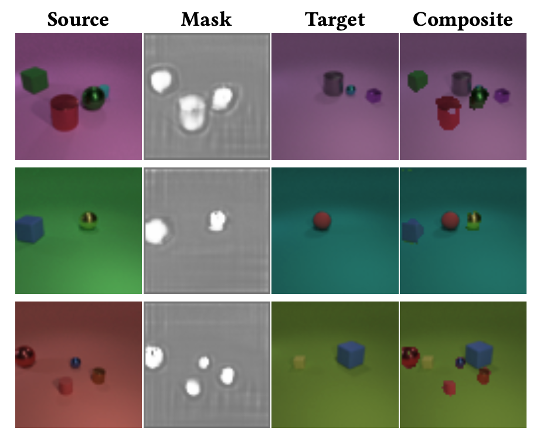
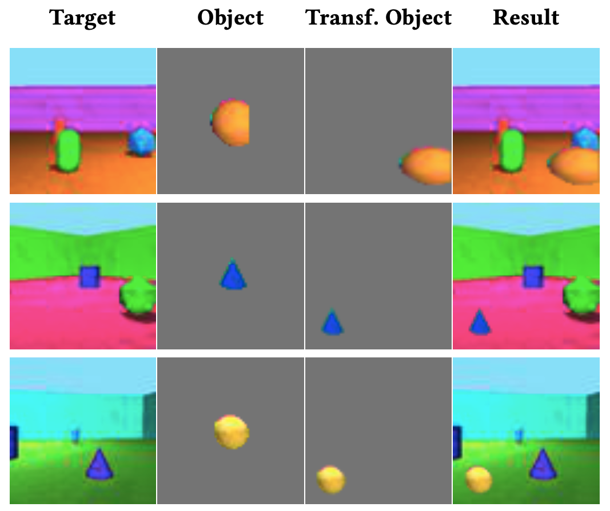

# CityGAN: Unsupervised Object Discovery and Learned Object Insertion Through Copy-PasteGANs

This repo contains the code for my MSc AI thesis project, exploring the use of GANs for the Municipality of Amsterdam. More specifically, the goal of this research is to create a pipeline that can discover objects in images (using the CopyGAN), in an unsupervised manner, and place those objects realistically in other images (using the MoveGAN). Essentially, the pipeline consists of two parts:
* The Copy-PasteGAN, which uses a copy-pasting principles to segment objects in an image (based on [Arandejovic, 2018](https://arxiv.org/abs/1905.11369))
* The MoveGAN, which takes an object and a target image, and applies a transformation to the object, such that it can be placed realistically in the target image. A small example is shown below.

The *_How it works_* section below contains more technical information about the model and underlying reasoning.


An example of the CopyGAN model, generating a mask for the objects in the source image.


An example of the MoveGAN model, inserting an object in the target image

---


## Project Folder Structure

The project setup is inspired by the [Pix2Pix framework](https://github.com/junyanz/pytorch-CycleGAN-and-pix2pix), and is structured as follows:

1) [`models`](./models): Folder containing all model classes (CopyGAN, MoveGAN, Classifier)
2) [`data`](./data): Folder containing all dataset classes and helper functions.
3) [`jobscripts`](./jobscripts): Folder containing all bash scripts used for generating datasets, training and testing models on a GPU-cluster ([https://userinfo.surfsara.nl/](Surfsara)).
4) [`options`](./options): Folder containing all command line options for various phases in training. Additional options can be defined in the model class definitions. 
5) [`util`](./util): Folder containing all utlity functions, including the visualizer (Visdom).
6) [`train.py`](./train.py): Training script for the all models. The type of model is specified using the *--model* parameter (copy, move or classifier)
7) [`test.py`](./test.py): Testing script for all models. The type of model is specified using the *--model* parameter.
8) [`requirements.txt`](./requirements.txt): Contains all the requirements for running this project


---


## Installation

Explain how to set up everything. 
Let people know if there are weird dependencies - if so feel free to add links to guides and tutorials.

1) Clone this repository:
    ```bash
    git clone https://github.com/Amsterdam-Internships/City-GAN
    ```

2) Install all dependencies:
    ```bash
    pip install -r requirements.txt
    ```
3) Download the datasets: The CLEVR dataset that is used is different from the [original](https://cs.stanford.edu/people/jcjohns/clevr/) as random colored backgrounds are added. This custom dataset can be generated the [blender_gen.sh](./jobscripts/blender_gen.sh) jobscript, that uses [Blender](https://docs.blender.org/api/current/index.html). Specific instructions can be found in [this](./jobscripts/README.md) README.
The ROOM dataset can be downloaded as TFRecord file from [here](https://console.cloud.google.com/storage/browser/multi-object-datasets/objects_room) (1M images, 7GB). The [tf_convert.sh](./jobscripts/tf_convert.sh) script can convert this TFRecord format to jpg images that can be used by the model. 
The classfier is trained on generated data (ROOM_composite), based on the output of the MoveGAN, and two baseline models. This data is generated using the [generate_move_eval_dataset.sh](./jobscripts/generate_move_eval_dataset.sh) script. 

4) Create a ./datasets directory with following structure:
```
    └── datasets
        ├── CLEVR
        │   └── images
        |       ├── train
        |       ├── val
        |       └── test
        └── ROOM
        │   └── images
        |       ├── train
        |       ├── val
        |       └── test
        └── ROOM_composite
        │   └── images
        |       ├── train
        |       ├── val
        |       └── test
        └── Cityscapes
        │   └── images
        |       ├── train
        |       ├── val
        |       └── test
        └── COCO
            └── images
                ├── complete
                └── small
            └── annotations
```
---


## Usage

The models can be trained seperately. Initially, they are trained on a GPU cluster using the scripts in the [jobscripts](./jobscript) directory. In these jobscripts all the parameters needed to run the training script are stated. 

In short, to train the CopyGAN:
```
$ python train.py --model copy --dataroot datasets/CLEVR/images
```
To train the MoveGAN: 
```
$ python train.py --model move --dataroot datasets/ROOM/images --dataset_mode 
```
Models and generated images will be saved to the ./checkpoints folder by default, as well as image outputs and loss plots.

To test the models:
```
$ python test.py --model copy --dataroot datasets/CLEVR/images
```
The generated images, IOU scores (for CopyGAN) and confusion matrix (for MoveGAN) will be saved to the results folder (that will automatically be created). All IOUs and statisics about the whole test set are printed to stdout. 

---


## How it works

Both the CopyGAN and the MoveGAN are based on adversarial learning, where two networks, the generator and discriminator, learn from each other. The generator produces the copy masks, or transformation parameters, respectively. The discriminator is tasked with evaluating the resulting images to be real or fake. Using this supervision from the discriminator, we can teach our generator to produce data that resembles real data (so that the discriminator cannot distinguish between the two anymore). 
The copy-principle that is used to discover and segment objects is based on the following intuition: The task is to copy a part of an image into another image, such that the resulting composite is realistic. Now one of the solutions to this would be to cut out objects, as they can be transferred into another image and still look realistic (provided that we take some assumptions about the data, and prevent shortcut solutions). The big advantage of this approach is that we don't need any annotated data, which makes the algorithm easy to apply in a variety of settings, without needing expensive human annotations.

The MoveGAN makes use of an affine transformation, to manipulate the object in order to fit in the target image. The scale can be adapted, as well as rotational parameters, and translation. The performance of the MoveGAN is compared to the current baselines: Random insertion, and scanline insertion, where the object is placed along the same y-coordinate, which is supposed to ensure consistent scales. To quantitatively evaluate this model, we train an image classifier, based on Resnet18. This model should classify images as being real, a MoveGAN image, or one of the baselines. Next, through the confusion matrix we hope to see that the classifier has difficulties distinguishing between the real and the MoveGAN images.  

A schematic drawing of the models is as follows:


---
## Acknowledgements
Supervisor University of Amsterdam: Dr. Nanne van Noord

Supervisor Gemeente Amsterdam: Laurens Samson, MSc

